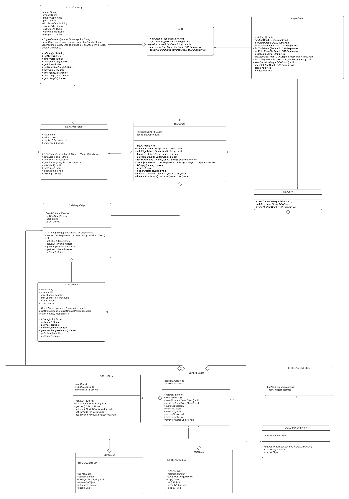

# Data Structures and Algorithms Assignment Report
AUTHOR: Connor Kuljis

DATE: 2020/11/01

UNIT: Data Structures and Algorithms (COMP1002) - Curtin University Bentley

# Introduction
This is a collection of java programs to explore the implemention 
of abstract data types (ADT), especially with cryptocurrency data.

Through the use of ADTs, cryptocurrencies (assets) and their trade pairs (trades)
can be represented in a program. 

The program constructs a graph, where each vertex/node is a representative crypto
currency. Each vertex is given a label eg: "BTC", and attatched is a 
CrypoCurrency Object, that holds information such as price, market cap, percentage change. 

Sequentially, edges (trade pairs) are added to the graph to connect two nodes. 
For example the trade pair "ETHBTC" creates a single directed path from ETH to BTC.
Lastly the trades within the last 24hrs are read in to create a CryptoTrade Object,
which is then attatched to the matching edge.

Resulting in the adjacency list such as:
```
ETH | [ BTC, ]
BTC | [ none ]
```
Resulting in the edge list such as:
```
[ETHBTC, ]
```

# Using this representation the program can 
* Read and parse csv / JSON files to construct a graph.
* Find an asset in the graph and return its CrypoCurrency Object.
* Find a trade in the graph and return its CrypoTrade Object.
* Find direct paths to other cryptocurrencies.
* Find all potential paths to other cryptocurrencies.
* Remove assets from the graph "filtering"
* Find top 10 cryptocurrencies by PRICE
* Find top 10 trade pairs by VOLUME

# Installation
Dependencies
* org.Json package

# How to run/install the program
## Compilation
* `javac -cp .:json.jar *.java`

## Run the program

* example $ `java -cp .:json.jar -i asset_info.csv exchangeInfo.json`

The program excpects 3 command line arguments

`java -cp .:json.jar cryptoGraph <flag> <asset_file.csv> <trade_data.json>`

 * `<flag> = '-i' or '-r' for interactive and report mode respectively"`
 * `<asset_file.csv> = asset file`
 * `<trade_data.json> = trade file`

# Files
* cryptoGraph.java      - This file provides the main function to run the program.
                        - Is responsible for calling functions that read, write, create and update
			- the graph.
* CryptoCurrency.java   - Class file for creating currency objects.
* CryptoTrade.java      - Class file for creating trade/pair objects.
* DSAGraph.java         - Graph Abstract Data Type (ADT) class.
                          Comprised from DSAGraphVertex and DSAGraphEdge class.
* DSAGraphEdge.java     - Class file for edge objects. Owned by DSAGraph.
* DSAGraphVertex.java   - Class file to store vertex information in graph.
* DSAHeap.java          - Heap Abstract Data Type (ADT) class.
* DSAHeapEntry.java     - Class file for heap entry while is owned by DSAHeap.java
* DSAJson.java          - JSON parser to read finance data.
* DSALinkedList.java    - LinkedList Abstract Data Type (ADT) class.
* DSAListNode.java      - ListNode Abstract Data Type (ADT) class. 
* DSAQueue.java         - Queue Abstract Data Type (ADT) class.
* DSAStack.java         - Stack Abstract Data Type (ADT) class.
* FileIO.java           - File I/O csv parser.

# Terminology
* "Asset" : 

# Walkthrough
`java -cp .:json.jar cryptoGraph <flag> <asset_file.csv> <trade_data.json>`

The program has two modes 
* "interactive mode" using the -i flag
* "report mode" using the -i flag

## Interactive mode ('-i')
When the program is run in this mode, the user is greeted with a menu.
The menu will loop until the user selects `9. Exit`
```
	Assets: xxxx
	Trades: xxxx
    "1. Load Data"
    "2. Find and display an asset"
    "3. Find and display trade details"
    "4. Find and display potential trade paths"
    "5. Set asset filter"
    "6. Asset overview"
    "7. Trade overview"
    "8. Save Data"
    "9. Exit"
```

### 1. Load Data

### 2. Find and display an asset
```
You selected, 2. Find and display an asset
Please enter the asset symbol eg: 'BTC'
>>>
```

The user will then input a symbol eg BTC and the data will be displayed
```
	name			: Bitcoin
	symbol			: BTC
	market cap		: 2.25970487355E11
	price			: 12199.63
	circulating supply	: "18,522,731 BTC"
	volume24hr		: 3.46577063E10
	change1hr		: 1.82%
	change24hr		: 4.2%
	change7d		: 6.71%
```

If the symbol cannot be found a short message is displayed
```
>>> junk
Cannot find 'JUNK'
```

The user is then prompted if to continue searching
```
find another asset? (y/n) >>>
```

### 3. Find and Display Trade Details
```
You selected, 3. Find and display trade details
Please enter the trade symbol eg: 'BTCETH'
```

The user will then input a symbol eg ethbtc and the data will be displayed.
```
>>> ethbtc
	name			: ETHBTC
	price			: 0.028229
	price change		: -2.16E-4
	price change %		: -0.759%
	volume			: 174841.101
	count			: 84327.0
```

If the symbol cannot be found a short message is displayed
```
>>> junk
Cannot find 'JUNK'
```

The user is then prompted if to continue searching
```
find another trade? (y/n) >>>
```

### 4. Find and Display Potential Trade Paths
```
Select an option >>> 4
4. Find and display potential trade paths
Please enter the source symbol eg: 'ETH'
>>> xrp

Please enter the destination symbol eg: 'BTC'
>>> usdt

POTENTIAL PATHS
BTC->USDT->
TUSD->USDT->
PAX->USDT->
USDC->USDT->
BUSD->USDT->
TRY->IDRT->BIDR->BKRW->DAI->TRY->BKRW->IDRT->BIDR->DAI->ETH->BTC->USDT->
TUSD->USDT->
PAX->USDT->
USDC->USDT->
BUSD->USDT->
TRY->IDRT->BIDR->BKRW->DAI->TRY->BKRW->IDRT->BIDR->DAI->USDT->
TUSD->USDT->
PAX->USDT->
USDC->USDT->
BUSD->USDT->
TRY->IDRT->BIDR->BKRW->DAI->TRY->BKRW->BIDR->DAI->USDT->
BNB->BTC->USDT->
TUSD->USDT->
PAX->USDT->
USDC->USDT->
BUSD->USDT->
TRY->IDRT->BIDR->BKRW->DAI->TRY->BKRW->IDRT->BIDR->DAI->ETH->BTC->USDT->
TUSD->USDT->
PAX->USDT->
USDC->USDT->
BUSD->USDT->
TRY->IDRT->BIDR->BKRW->DAI->TRY->BKRW->IDRT->BIDR->DAI->USDT->
TUSD->USDT->
PAX->USDT->
USDC->USDT->
BUSD->USDT->
TRY->IDRT->BIDR->BKRW->DAI->TRY->BKRW->BIDR->DAI->USDT->
PAX->USDT->
TUSD->USDT->
USDC->USDT->
BUSD->USDT->
TRY->IDRT->BIDR->BKRW->DAI->TRY->BKRW->IDRT->BIDR->DAI->PAX->USDT->
TUSD->USDT->
USDC->USDT->
BUSD->USDT->
TRY->IDRT->BIDR->BKRW->DAI->TRY->BKRW->Find another trade? (y/n) >>
```

### 5. Set Asset Filter
`asset filter not functioning`

### 6. Asset Overview
```
You selected, 6. Asset overview
TOP ASSET NUMBER 1 BY PRICE
	name			: 42-coin
	symbol			: 42
	market cap		: 2676760.0
	price			: 63732.45
	circulating supply	: 42 42
	volume24hr		: 3080.0
	change1hr		: 2.39%
	change24hr		: 65.91%
	change7d		: 18.61%
TOP ASSET NUMBER 2 BY PRICE
	name			: Project-X
	symbol			: NANOX
	market cap		: 1665.0
	price			: 21273.84
	circulating supply	: 0 NANOX *
	volume24hr		: 29.0
	change1hr		: 18.27%
	change24hr		: 4.01%
	change7d		: 15.9%
TOP ASSET NUMBER 3 BY PRICE
	name			: yearn.finance
	symbol			: YFI
	market cap		: 4.08125766E8
	price			: 13618.85
	circulating supply	: "29,968 YFI *"
	volume24hr		: 2.97636628E8
	change1hr		: 2.68%
	change24hr		: -2.45%
	change7d		: -13.52%
TOP ASSET NUMBER 4 BY PRICE
	name			: RSK Smart Bitcoin
	symbol			: RBTC
	market cap		: 4716200.0
	price			: 12509.8
	circulating supply	: 377 RBTC
	volume24hr		: 62014.0
	change1hr		: 0.41%
	change24hr		: 3.17%
	change7d		: -0.5%
TOP ASSET NUMBER 5 BY PRICE
	name			: The Tokenized Bitcoin
	symbol			: imBTC
	market cap		: 0.0
	price			: 12233.88
	circulating supply	: ? imBTC *
	volume24hr		: 3364995.0
	change1hr		: 2.81%
	change24hr		: 4.51%
	change7d		: 6.94%
TOP ASSET NUMBER 6 BY PRICE
	name			: Huobi BTC
	symbol			: HBTC
	market cap		: 5.8817448E7
	price			: 12227.74
	circulating supply	: "4,810 HBTC *"
	volume24hr		: 0.0
	change1hr		: 1.9%
	change24hr		: 4.32%
	change7d		: 6.85%
TOP ASSET NUMBER 7 BY PRICE
	name			: Wrapped Bitcoin
	symbol			: WBTC
	market cap		: 1.304154519E9
	price			: 12212.79
	circulating supply	: "106,786 WBTC *"
	volume24hr		: 8.7405727E7
	change1hr		: 1.9%
	change24hr		: 4.31%
	change7d		: 6.84%
TOP ASSET NUMBER 8 BY PRICE
	name			: Bitcoin
	symbol			: BTC
	market cap		: 2.25970487355E11
	price			: 12199.63
	circulating supply	: "18,522,731 BTC"
	volume24hr		: 3.46577063E10
	change1hr		: 1.82%
	change24hr		: 4.2%
	change7d		: 6.71%
TOP ASSET NUMBER 9 BY PRICE
	name			: Bitcoin BEP2
	symbol			: BTCB
	market cap		: 6.0824652E7
	price			: 12162.12
	circulating supply	: "5,001 BTCB *"
	volume24hr		: 14953.0
	change1hr		: -3.49%
	change24hr		: 5.93%
	change7d		: 7.09%
TOP ASSET NUMBER 10 BY PRICE
	name			: renBTC
	symbol			: RENBTC
	market cap		: 3.08411186E8
	price			: 12116.89
	circulating supply	: "25,453 RENBTC *"
	volume24hr		: 1.2597091E7
	change1hr		: 3.2%
	change24hr		: 3.32%
	change7d		: 5.67%
	Assets: 2483
	Trades: 767
```

### 7. Trade Overview
```
OP TRADE NUMBER 1 BY VOLUME
	name			: BTTUSDT
	price			: 2.997E-4
	price change		: 1.38E-5
	price change %		: 4.827%
	volume			: 1.0803865408E10
	count			: 6951.0
TOP TRADE NUMBER 2 BY VOLUME
	name			: WINUSDT
	price			: 8.17E-5
	price change		: 2.6E-6
	price change %		: 3.287%
	volume			: 8.651143199E9
	count			: 8009.0
TOP TRADE NUMBER 3 BY VOLUME
	name			: BTTTRX
	price			: 0.01136
	price change		: 9.0E-5
	price change %		: 0.799%
	volume			: 1.7317750467E9
	count			: 5183.0
TOP TRADE NUMBER 4 BY VOLUME
	name			: WINTRX
	price			: 0.00309
	price change		: -3.0E-5
	price change %		: -0.962%
	volume			: 1.166388851E9
	count			: 3559.0
TOP TRADE NUMBER 5 BY VOLUME
	name			: VETUSDT
	price			: 0.01028
	price change		: 6.31E-4
	price change %		: 6.54%
	volume			: 9.04301149E8
	count			: 34251.0
TOP TRADE NUMBER 6 BY VOLUME
	name			: WINBNB
	price			: 2.84E-6
	price change		: 0.0
	price change %		: 0.0%
	volume			: 8.87818538E8
	count			: 4881.0
TOP TRADE NUMBER 7 BY VOLUME
	name			: TRXUSDT
	price			: 0.02643
	price change		: 0.00105
	price change %		: 4.137%
	volume			: 6.836642243E8
	count			: 35881.0
TOP TRADE NUMBER 8 BY VOLUME
	name			: RSRUSDT
	price			: 0.01169
	price change		: 6.9E-4
	price change %		: 6.273%
	volume			: 5.543434074E8
	count			: 27661.0
TOP TRADE NUMBER 9 BY VOLUME
	name			: BTTBNB
	price			: 1.045E-5
	price change		: 1.6E-7
	price change %		: 1.555%
	volume			: 5.38619843E8
	count			: 6391.0
TOP TRADE NUMBER 10 BY VOLUME
	name			: IOSTUSDT
	price			: 0.004912
	price change		: 2.43E-4
	price change %		: 5.205%
	volume			: 5.2335653E8
	count			: 10754.0
	Assets: 2483
	Trades: 767
```

### 8. Save Data
`serialization not functioning`

### 9. Exit
```
Exiting program...
```
# Future Work
One function to be added is the read/writing of serialized objects. Java provides a built-in serialization class, yet 
there were some issues in getting it to save properly. A fix may be related to the recursion limit being reached.

Using the CryptoTrade data as 'weights' a Dijkstra Shortest Path or Bellman–Ford Algorithm could be implemented to 
find paths/negative cycles in the graph. The weights could be use the CryptoTrade price change field as a weight for example

Alternatively automatic API requesting could be implemented so that json and csv files do not have to be downloaded.

# Matrix


# Class Diagram


# Class Descriptions
## cryptoGraph.java      - This file provides the main function to run the program.
This is the class that contains the main method that users will run.
It was created as part of specification. It comprises of a menu function that breaks down in to
smaller sub menus. The overall design is has high modularity and low cohesion

## CryptoCurrency.java and CryptoTrade.java      
Class file for creating currency and trade/pair objects.
This class serves the purpose of storing information about cryptocurrencies / trades.
Each its own class so that inforamtion can be stored, received and updated.
The object can then be implemented into data structures such as linkedlists/heaps/graphs

# Justification

# References
